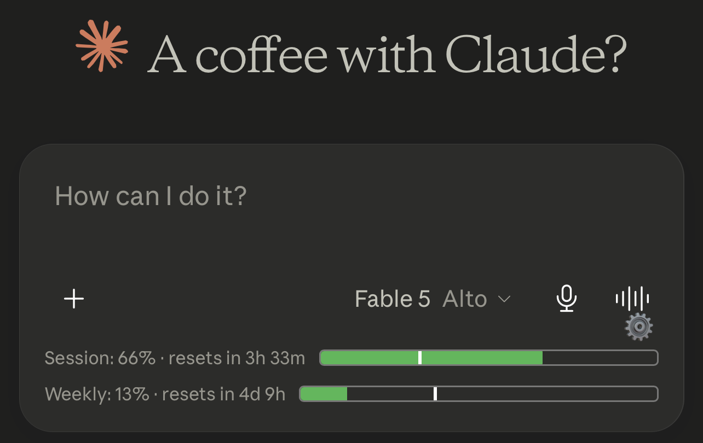
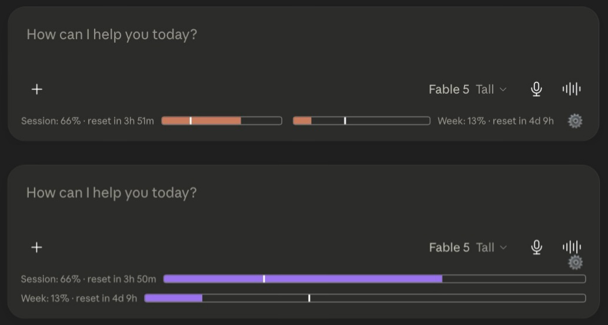

# Claude Tracker — usage bars for claude.ai, everywhere

[](https://ko-fi.com/marukoshi)
[](https://github.com/sponsors/MarkusSela)
[](https://github.com/MarkusSela/claude-tracker-safari/actions/workflows/build.yml)

A browser extension that adds a live usage panel to **claude.ai**: token
count, cache timer, and **session (5h)** / **weekly (7d)** usage bars, right
inside the chat. No account, no data collection, open source.

**Platforms:** Safari (iOS · iPadOS · macOS) · Chrome · Brave · Edge ·
Firefox (desktop + Android) · Claude Desktop on Linux (experimental).

Ported and extended from the Firefox/Chrome extension "Claude Counter" (MIT).

| iPhone | Mac |
|---|---|
|  |  |

## Features

- **Live usage bars** — session (5h) and weekly (7d) quota, updating in real
  time as you chat. Tap the row to force a refresh.
- **Time marker** — the vertical line inside each bar shows where you are *in
  time* within the window. Fill ahead of the line = burning quota faster than
  the window resets.
- **Token counter** — approximate conversation tokens + prompt-cache countdown.
- **Settings panel** (⚙ gear): **7 languages** (EN · IT · 中文 · 日本語 ·
  Русский · Português · العربية), bar color presets, inline/stacked layout.
- **Live author card** — profile + funding goal fetched from this repo's
  `meta.json`, never stale inside the app.
- **Theme-aware** — follows claude.ai light/dark mode.

All platforms build from the same extension source — every feature ships
everywhere.

## Install

### iPhone / iPad — via SideStore

1. Install [SideStore](https://sidestore.io) (one-time PC setup, free Apple ID).
2. SideStore → **Sources → ＋** →
   `https://markussela.github.io/claude-tracker-safari/source.json`
3. Install **Claude Tracker**, enable it in **Settings → Apps** and in
   Safari's extension settings, then open **claude.ai**.

> Registers **two App IDs** (app + extension) — both required. Free-account
> certs expire after 7 days; SideStore auto-refreshes.

### Mac (Safari)

1. Download `ClaudeTracker-macOS.zip` from [Releases](../../releases/latest),
   unzip, move to Applications, open once.
2. Safari → Settings → Advanced → **Show features for web developers**.
3. Safari → Develop → **Allow Unsigned Extensions** (resets on Safari restart).
4. Safari → Settings → Extensions → enable, then open **claude.ai**.

### Chrome / Brave / Edge

Store listing not live yet. Manual load:

1. Grab `claude-tracker-chromium.zip` from [Releases](../../releases/latest)
   (or the *Pack browser + desktop builds* workflow artifacts), unzip.
2. `chrome://extensions` → **Developer mode** → **Load unpacked** → select the
   unzipped folder (the one containing `manifest.json`).

### Firefox (desktop + Android)

Submitted to Firefox Add-ons (AMO) — under review. Once live, one-click
install on desktop **and Android Firefox**. Meanwhile: `about:debugging` →
**Load Temporary Add-on** → pick `manifest.json` from
`claude-tracker-firefox.zip`.

### Claude Desktop on Linux — experimental

For [claude-desktop-debian](https://github.com/aaddrick/claude-desktop-debian)
installs. Injects the tracker into the Electron app without touching
`app.asar` or the launcher (drops a wrapper at Electron's `resources/app/`,
which loads before the asar).

```bash
unzip claude-tracker-desktop-inject.zip
cd claude-tracker-safari/desktop-inject
sudo bash install.sh      # sudo bash uninstall.sh to remove
```

> **Status: experimental / unverified.** Injection works; whether the bars
> attach depends on Claude Desktop's internal app matching claude.ai's DOM
> and SSE events. Reports welcome via issues.

## Build it yourself

- **Safari (iOS + macOS):** GitHub Actions macOS runner —
  `.github/workflows/build.yml`. No Mac needed. Local: `scripts/build-safari.sh`.
- **Browser zips + desktop kit:** `.github/workflows/pack-browsers.yml`, or
  locally `scripts/pack-browsers.sh` and `desktop-inject/build-bundle.sh`.
- GitHub Pages (branch `main`, folder `/docs`) serves `source.json` (SideStore)
  and `meta.json` (live author card).

## Roadmap

- **More AI providers** — trackers for AI chats whose usage isn't clearly
  visible. Per-provider adapters; the generic bundle ID (`aitracker`) is built
  for this. Want one? Open an issue.
- **iOS home-screen widget** — last-known usage + live reset countdown
  (WidgetKit + native messaging).
- Store listings: Chrome Web Store, Edge Add-ons, AMO approval.
- Alternate app icons, small supporter perks.

## Support ☕

**🎯 Goal — Apple Developer Program ($99/yr):** App Store / TestFlight
release: one-tap installs, auto-updates, no SideStore, no 7-day certs.
Progress shown live in the app's settings panel.

[](https://ko-fi.com/marukoshi)

## Privacy · Credits · License

No data collected — see [PRIVACY.md](PRIVACY.md). Ported and maintained by
[MarkusSela](https://github.com/MarkusSela); based on "Claude Counter" (MIT),
see [LICENSE](LICENSE). Not affiliated with Anthropic — "Claude" is a
trademark of Anthropic.
